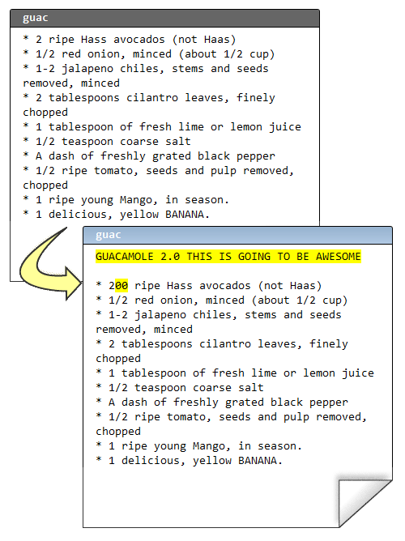
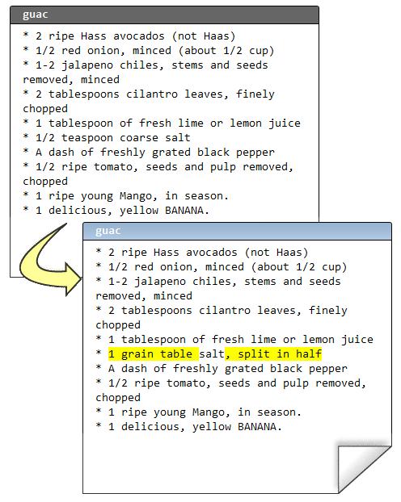

.. epigraph::

    **Mercurial 带给你极具灵活性的版本库组织方式. 由于合并操作如此和谐, 你完全可以信赖它们 (合并), 这意味着你可以建立一些特殊用途的版本库, 以匹配你的开发流程.**

================
版本库组织方式
================

我们的配方已经非常完美了::

    C:\Users\joel\recipes> hg log -l 3
    changeset:   13:1b03ab783b17
    tag:         tip
    parent:      12:f923c9049234
    parent:      11:0bd396c9b89b
    user:        Rose Hillman <rose@example.com>
    date:        Thu Feb 11 23:01:55 2010 -0500
    summary:     merge

    changeset:   12:f923c9049234
    parent:      10:8646f8cd7154
    user:        Rose Hillman <rose@example.com>
    date:        Thu Feb 11 22:49:31 2010 -0500
    summary:     mmmmango

    changeset:   11:0bd396c9b89b
    user:        Joel Spolsky <joel@joelonsoftware.com>
    date:        Thu Feb 11 22:46:47 2010 -0500
    summary:     bananas YUM

让我们再来仔细看看变更集编号::

    changeset:   13:1b03ab783b17

编号的第一部分, 13, 简短方便. 但有一个问题... 它很不靠谱!

当团队的每个成员各自开发, 然后合并代码, 这些短编码并未被同步:

.. image:: _images/05-repo.png

所以, 实际上我根本没法跟其他人说 "好, 让我们发布第 13 号变更集的版本吧", 因为他们可能对 13 这个数字有不同的理解. 这就是为什么还有一串古怪的 16 进制编码.

::

    changeset:   13:1b03ab783b17

16 进制编码在所有版本库 **都** 保持一致, 而且永远不会改变.

OK, 我现在可以告诉其他人, "嘿, 我们今天发布! 变更集编号是 1b03ab783b17! 如果我能给这个变更集取个 *名字* 不是更好?

嗯, 你的确可以. 我们称之为一个 **标签**.

::

    C:\Users\joel\recipes> hg tag Version-1.0

我们再来看看日志::

    C:\Users\joel\recipes> hg log -l 2
    changeset:   14:1adc88356f40
    tag:         tip
    user:        Joel Spolsky <joel@joelonsoftware.com>
    date:        Fri Feb 12 09:38:06 2010 -0500
    summary:     Added tag Version-1.0 for changeset 1b03ab783b17

    changeset:   13:1b03ab783b17
    tag:         Version-1.0
    parent:      12:f923c9049234
    parent:      11:0bd396c9b89b
    user:        Rose Hillman <rose@example.com>
    date:        Thu Feb 11 23:01:55 2010 -0500
    summary:     merge

注意, 之前添加标签的动作是一个标准的变更集, 它还帮我自动提交了本次变更. 从现在开始, 每次我要提及我们发布的代码版本号, 我都可以用 **Version-1.0** 代替 **1b03ab783b17**. 

CEO 从 31 楼下来参加官方发布聚会, 还顺带了一整箱看上去相当昂贵的香槟. Stan 有点醉了. 嗯, 醉得不止一点. 没人看过他这个样子. 他脱掉了衬衫, 显示他尚未松弛的肌肉, 试图吸引来自市场部的女同事. "我能拉住那些吊灯," 他瞎吹 (我们有几盏长型荧光吊灯). 接着他一跃而起, 抓住灯座, 然后可想而知了, 整个灯架立马被他拽了下来, 因为那台十磅重的灯座只是用几根细细的钢琴弦吊着, 但这家伙的体重在争议较大的区间 290~300 磅之间. 他把整个灯具和一些天花板吊顶给拽了下来, 玻璃和吸声瓦材料破碎一地, 他自己也重重的摔在地板上, 凄惨的叫道他打算起诉公司没有创造一个安全的工作环境.

其他人都回到了各自的办公隔间, 继续开发 鳄梨酱 2.0

提交::

    C:\Users\joel\recipes> hg com -m "more avocado flavor"

显而易见, 配方现在处于非稳定状态. 它没有经过测试或者其它验证. 接着, 某客户一个电话过来.

"这太咸了!" 他悲嗥道. 而且, 他不能等到 2.0 版本再修正.

幸运的是, 我们之前打了标签. 我可以使用 **hg up** 切换到版本库中的任何版本.

::

    C:\Users\joel\recipes> hg up -r Version-1.0
    1 files updated, 0 files merged, 1 files removed, 0 files unresolved

    C:\Users\joel\recipes> type guac
    * 2 ripe Hass avocados (not Haas)
    * 1/2 red onion, minced (about 1/2 cup)
    * 1-2 jalapeno chiles, stems and seeds removed, minced
    ...

现在我可以开始修正他这个愚蠢的用盐过量的问题了::

接着::

    C:\Users\joel\recipes> hg diff
    diff -r 1b03ab783b17 guac
    --- a/guac      Thu Feb 11 23:01:55 2010 -0500
    +++ b/guac      Fri Feb 12 10:44:19 2010 -0500
    @@ -3,7 +3,7 @@
     * 1-2 jalapeno chiles, stems and seeds removed, minced
     * 2 tablespoons cilantro leaves, finely chopped
     * 1 tablespoon of fresh lime or lemon juice
    -* 1/2 teaspoon coarse salt
    +* 1 grain table salt, split in half
     * A dash of freshly grated black pepper
     * 1/2 ripe tomato, seeds and pulp removed, chopped
     * 1 ripe young Mango, in season.

    C:\Users\joel\recipes> hg com -m "less salt"
    created new head

Mercurial 提醒我

