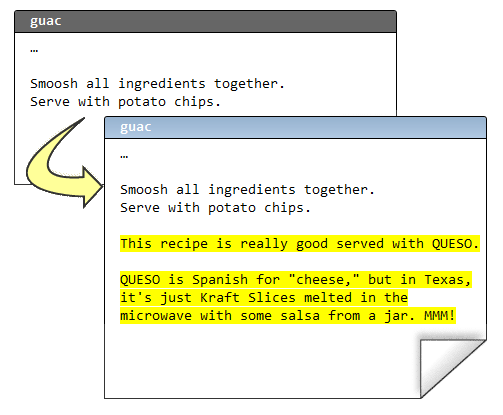

.. epigraph::

    **使用 Mercurial 的一个最大好处是, 你可以使用私有本地库来尝试和开发新特性... 如果它们不管用, 你可以短时间内恢复.**

=======================
修复错误
=======================

Mercurial 让你能够自由试验. 试想在日常编辑过程中, 你的编辑器发生了异常, 结果你的代码 "杯具" 了:

.. image:: _images/03-00.png

``hg revert``
-----------------

.. note:: ``hg revert``
    
    将修改的文件恢复到最近一次提交后的状态

爱上 emacs. 不管怎样, 啥也没弄丢. 从这类情况中恢复回来最常用的操作是使用 **hg revert**::

    C:\Users\joel\recipes> hg revert guac

之后文件便恢复到它们最近一次提交完成时的状态. Mercurial 不会乱删任何东西, 所以它没有删掉 Pig Latin (译注:  故意颠倒英语字母顺序拼凑而成的行话) 式的配方, 而是采用重命名的方式::

    C:\Users\joel\recipes> dir
     Volume in drive C has no label.
     Volume Serial Number is 84BD-9C2C

     Directory of C:\Users\joel\recipes

    02/11/2010  11:16 AM    <DIR>          .
    02/11/2010  11:16 AM    <DIR>          ..
    02/11/2010  11:16 AM    <DIR>          .hg
    02/11/2010  11:16 AM               393 guac
    02/11/2010  11:15 AM               510 guac.orig
                   2 File(s)            903 bytes
                   3 Dir(s)  40,958,005,248 bytes free

    C:\Users\joel\recipes> del guac

    C:\Users\joel\recipes> rename guac.orig guac

如果你多走了一步, 已经提交了该怎么办?

::

    C:\Users\joel\recipes> hg com -m "Pig Latin ftw"

    C:\Users\joel\recipes> hg log -l 3
    changeset:   5:c7af1973de6d
    tag:         tip
    user:        Joel Spolsky <joel@joelonsoftware.com>
    date:        Thu Feb 11 11:32:27 2010 -0500
    summary:     Pig Latin ftw

    changeset:   4:0849ca96c304
    parent:      2:4ecdb2401ab4
    parent:      3:689026657682
    user:        Joel Spolsky <joel@joelonsoftware.com>
    date:        Mon Feb 08 16:07:23 2010 -0500
    summary:     merge

    changeset:   3:689026657682
    parent:      1:a52881ed530d
    user:        Rose Hillman <rose@example.com>
    date:        Mon Feb 08 15:29:09 2010 -0500
    summary:     spicier kind of chile

``hg rollback``
-----------------

.. note:: ``hg rollback``
    
    撤销最后一次提交, 前提是你还没有把它推送 (push) 给其他人

**hg rollback** 可以挽救你, 但当且仅当你还没有把变更推送 (push) 给其他人. 它只能撤销 *一次* 提交.

::

    C:\Users\joel\recipes> hg rollback
    rolling back last transaction

    C:\Users\joel\recipes> hg log -l 3
    changeset:   4:0849ca96c304
    tag:         tip
    parent:      2:4ecdb2401ab4
    parent:      3:689026657682
    user:        Joel Spolsky <joel@joelonsoftware.com>
    date:        Mon Feb 08 16:07:23 2010 -0500
    summary:     merge

    changeset:   3:689026657682
    parent:      1:a52881ed530d
    user:        Rose Hillman <rose@example.com>
    date:        Mon Feb 08 15:29:09 2010 -0500
    summary:     spicier kind of chile

    changeset:   2:4ecdb2401ab4
    user:        Joel Spolsky <joel@joelonsoftware.com>
    date:        Mon Feb 08 15:32:01 2010 -0500
    summary:     potato chips. No one can eat just one.

    C:\Users\joel\recipes> hg stat
    M guac

    C:\Users\joel\recipes> hg revert guac

假设你私底下在做一项重要尝试. 你的老板雇了一个新设计师, Jim, 但最近你从他那拿到的规格说明非常的愚蠢. 正文采用绿色荧光, 而且参差不齐 (出于 "艺术效果" 考虑), 可用性非常糟糕. 你甚至都想用一个周末的时间重新处理一下, 但是你为提交的事犯愁, 因为你没法 100% 确保你的想法比那个疯狂的图形设计师会更好. Jim 从他起床的那一刻到睡觉前基本上都在抽大麻. 你不想用这件事来攻击他, 而且所有人都认为只要他的设计不错, 这不关任何人的事, 但说实话, 这总得有个底限. 对吧? 而且他的设计说不上好. 加上他还有些让人不爽.

使用 Mercurial, 你可以 ``clone`` 出一份完整的试验库::

    C:\Users\joel\recipes> cd ..

    C:\Users\joel> hg clone recipes recipes-experiment
    updating to branch default
    1 files updated, 0 files merged, 0 files removed, 0 files unresolved

效率并不像看上去的那么低. 由于 **recipes** 和 **recipes-experiment** 共享了 (目前为止) 所有的历史, Mercurial 会使用文件系统的一个特性 - "硬链接 (hard links)" 使复制操作异常迅速, 而且占用更少的磁盘空间.

现在, 我们来对试验分支做些变更::

    C:\Users\joel> cd recipes-experiment

以下就是我那顶级牛油果酱试验版:

在试验库里, 我们可以自主决定 commit 与否.

::

    C:\Users\joel\recipes-experiment> hg com -m "Queso = Cheese!"

你可以无拘无束的修改文件, 在任何时候提交变更. 它给予你源代码控制的所有权力, 甚至支持你做一些疯狂的试验, 而不会给其他人制造麻烦.

如果你最终发现试验失败, 你只须删除整个试验目录, 问题就解决了, 一去不复返.

但如果试验成功, 你只要 push 新的变更即可::

    C:\Users\joel\recipes-experiment> hg push
    pushing to c:\Users\joel\recipes
    searching for changes
    adding changesets
    adding manifests
    adding file changes
    added 1 changesets with 1 changes to 1 files

``hg paths``
-----------------

.. note:: ``hg paths``
    
    显示远程版本库列表

提交的变更上哪儿去了?

::

    C:\Users\joel\recipes-experiment> hg paths
    default = c:\Users\joel\recipes

"default" 的键值为 **hg push** 缺省 (即命令行参数中未指定其它版本库) 推送变更的目标库路径. 一般而言下, "default" 的键值是你 ``clone`` 时的目标库. 在本例情况中, 它的值为本地目录, 当然你也可以将值改为一个 URL.

::

    C:\Users\joel\recipes-experiment> cd ..\recipes

注意别忘了, 变更正是推送到这个 *版本库* ...

::

    C:\Users\joel\recipes> hg log -l 3
    changeset:   5:9545248f3fc9
    tag:         tip
    user:        Joel Spolsky <joel@joelonsoftware.com>
    date:        Thu Feb 11 12:59:11 2010 -0500
    summary:     Queso = Cheese!

    changeset:   4:0849ca96c304
    parent:      2:4ecdb2401ab4
    parent:      3:689026657682
    user:        Joel Spolsky <joel@joelonsoftware.com>
    date:        Mon Feb 08 16:07:23 2010 -0500
    summary:     merge

    changeset:   3:689026657682
    parent:      1:a52881ed530d
    user:        Rose Hillman <rose@example.com>
    date:        Mon Feb 08 15:29:09 2010 -0500
    summary:     spicier kind of chile

``hg parent``
-----------------

.. note:: ``hg parent``
    
    显示当前正基于哪 (几) 个变更集进行开发工作

... 但这并不表示我们当前工作在推送后的版本.

::

    C:\Users\joel\recipes> type guac
    * 2 ripe avocados
    * 1/2 red onion, minced (about 1/2 cup)
    * 1-2 habanero chiles, stems and seeds removed, minced
    * 2 tablespoons cilantro leaves, finely chopped
    * 1 tablespoon of fresh lime or lemon juice
    * 1/2 teaspoon coarse salt
    * A dash of freshly grated black pepper
    * 1/2 ripe tomato, seeds and pulp removed, chopped

    Smoosh all ingredients together.
    Serve with potato chips.

    C:\Users\joel\recipes> hg parent
    changeset:   4:0849ca96c304
    parent:      2:4ecdb2401ab4
    parent:      3:689026657682
    user:        Joel Spolsky <joel@joelonsoftware.com>
    date:        Mon Feb 08 16:07:23 2010 -0500
    summary:     merge

看到了没? "Queso" 相关的修改在 5 号变更集. 但是我的个人主库当前工作在 4 号变更集, 这是因为某人向 *版本库* 推送新的变更并不意味着这些变更就会在我的工作目录生效, 所以我当前所有工作仍然是基于 4 号变更集.

.. image:: _images/03-repo.png

如果我想看看 5 号变更集里面到底有些啥, 我可以使用 **hg update** 命令::

    C:\Users\joel\recipes> hg up
    1 files updated, 0 files merged, 0 files removed, 0 files unresolved

    C:\Users\joel\recipes> hg parent
    changeset:   5:9545248f3fc9
    tag:         tip
    user:        Joel Spolsky <joel@joelonsoftware.com>
    date:        Thu Feb 11 12:59:11 2010 -0500
    summary:     Queso = Cheese!

    C:\Users\joel\recipes> type guac
    * 2 ripe avocados
    * 1/2 red onion, minced (about 1/2 cup)
    * 1-2 habanero chiles, stems and seeds removed, minced
    * 2 tablespoons cilantro leaves, finely chopped
    * 1 tablespoon of fresh lime or lemon juice
    * 1/2 teaspoon coarse salt
    * A dash of freshly grated black pepper
    * 1/2 ripe tomato, seeds and pulp removed, chopped

    Smoosh all ingredients together.
    Serve with potato chips.

    This recipe is really good served with QUESO.

    QUESO is Spanish for "cheese," but in Texas,
    it's just Kraft Slices melted in the microwave
    with some salsa from a jar. MMM!

瞧瞧发生了什么? 变更生效了, 但是是基于我之前工作版本之上的. **push** 和 **pull** 仅仅将变更从一个版本库发送到另一个 -- 不会影响当前正在开发的文件.

