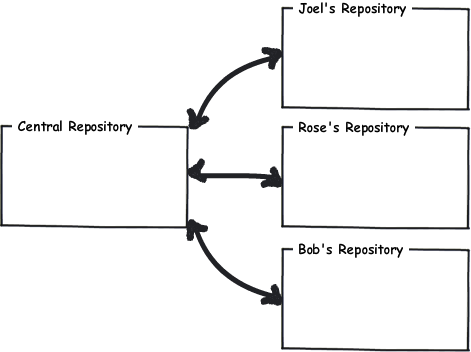
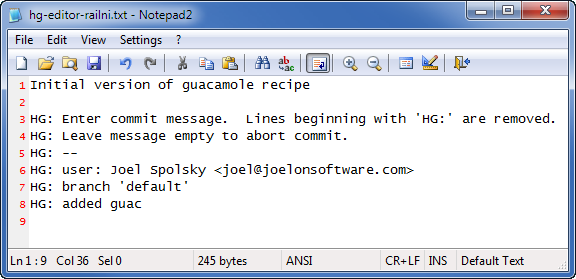

.. epigraph::

    **使用 Mercurial 的一个好处是团队能够进行协作开发. Mercurial 让你能够独立工作, 又能随时合并变更.**

团队协作
============

用 Mercurial 进行协作开发最常用的方法是建立一个中央库, 此外我们各自的 PC 上都有一份私有版本库. 我们可以把中央库当作交换中心, 相当于我们聚在一起交换我们所做的变更.

hg serve
-----------

快速建立中央库的最简陋的方法是使用 Mercurial 内置的 WEB 服务器 --  你所作的仅仅是用 **hg init** 创建一个版本库, 然后用 **hg serve** 启动 WEB 服务. 默认情况下, 它会占用 8000 端口.

::

    C:\> mkdir CentralRepo
    
    C:\> cd CentralRepo
    
    C:\CentralRepo> hg init
    
    C:\CentralRepo> hg serve

这台 PC 的主机名是 **joel.example.com**, 我只要用浏览器登录 **http://joel.example.com:8000/** 便可看到服务器已经启动并正在运行, 虽然版本库还是空白一片.

.. image:: _images/02-web.png

一旦中央 WEB 服务器开始服务, 我可以从服务器 *克隆 (clone)* 版本库到我的个人 PC 自主使用. 这个版本库现在还是空的, 所以我克隆后得到的也是空白库.

::

    C:\Users\joel> hg clone http://joel.example.com:8000/ recipes
    no changes found
    updating to branch default
    0 files updated, 0 files merged, 0 files removed, 0 files unresolved
    
    C:\Users\joel> cd recipes
    
    C:\Users\joel\recipes> dir
     Volume in drive C has no label.
     Volume Serial Number is 84BD-9C2C
    
     Directory of C:\Users\joel\recipes
    
    02/08/2010  02:46 PM    <DIR>          .
    02/08/2010  02:46 PM    <DIR>          ..
    02/08/2010  02:46 PM    <DIR>          .hg
                   0 File(s)              0 bytes
                   3 Dir(s)  41,852,125,184 bytes free

现在, 我们新建一个名为 **guac** 的文件, 记录本人有名的牛油果酱秘方.

**``guac``**::

    * 2 ripe avocados
    * 1/2 red onion, minced (about 1/2 cup)
    * 1-2 serrano chiles, stems and seeds removed, minced
    * 2 tablespoons cilantro leaves, finely chopped
    * 1 tablespoon of fresh lime or lemon juice
    * 1/2 teaspoon coarse salt
    * A dash of freshly grated black pepper
    * 1/2 ripe tomato, seeds and pulp removed, chopped
    
    Crunch all ingredients together.
    Serve with tortilla chips.

我将添加这个文件, 并作为我的第一个官方版本提交:

::

    C:\Users\joel\recipes> hg add
    adding guac
    
    C:\Users\joel\recipes> hg commit

以及提交摘要:

现在, 我要编辑这个文件, 做些小改动, 这样版本库里就会留下些历史记录了.

.. image:: _images/02-00.png

接着提交这次变更::

    C:\Users\joel\recipes> hg status
    M guac
    
    C:\Users\joel\recipes> hg diff guac
    diff -r c1fb7e7fbe50 guac
    --- a/guac      Mon Feb 08 14:50:08 2010 -0500
    +++ b/guac      Mon Feb 08 14:51:08 2010 -0500
    @@ -7,5 +7,5 @@
     * A dash of freshly grated black pepper
     * 1/2 ripe tomato, seeds and pulp removed, chopped
    
    -Crunch all ingredients together.
    +Smoosh all ingredients together.
     Serve with tortilla chips.
    
    C:\Users\joel\recipes> hg com -m "Change crunch to smoosh"
    
    C:\Users\joel\recipes> hg log
    changeset:   1:a52881ed530d
    tag:         tip
    user:        Joel Spolsky <joel@joelonsoftware.com>
    date:        Mon Feb 08 14:51:18 2010 -0500
    summary:     Change crunch to smoosh
    
    changeset:   0:c1fb7e7fbe50
    user:        Joel Spolsky <joel@joelonsoftware.com>
    date:        Mon Feb 08 14:50:08 2010 -0500
    summary:     Initial version of guacamole recipe

注意我这次提交的时候, 头一次使用了 **-m** 参数. 这只是在命令行下, 不通过编辑器输入提交摘要的一个方法.

OK, 我们在哪儿? 到目前为止, 我能访问中央库, 还克隆了一份本地库. 我已经做了两次变更并提交到本地库, 但是这些变更只存在于我的本地库 -- 它们还没有进入中央库. 所以现在的状况是:

.. image:: _images/02-repo-2.png

现在我将使用 **hg push** 命令, 把我的变更从我的本地库 **推入** 到中央库::

    C:\Users\joel\recipes> hg push
    pushing to http://joel.example.com:8000/
    searching for changes
    ssl required

我靠, 居然报错. 我暂时不考虑随便运行一个 WEB 服务器, 还允许任何人把他们那愚蠢的变更推到中央库所带来的安全问题. 忍耐一小会; 我要去配置一下服务器, 让任何人都可以为所欲为. 这需要编辑一下 ``.hg\hgrc`` 文件. 

``.hg\hgrc``::

    [web]
    push_ssl=False
    allow_push=*

显然, 这是很危险的, 但是如果你处在一个安全的局域网环境下工作, 有一个优秀的防火墙, 而且你信任局域网中的每个人, 这样的话是安全的. 否则, 你可能要去看看手册中关于安全的进阶章节.

好, 我们重新启动服务器::

    C:\CentralRepo> hg serve

现在我应该可以 push 变更集了::

    C:\Users\joel\recipes> hg push
    pushing to http://joel.example.com:8000/
    searching for changes
    adding changesets
    adding manifests
    adding file changes
    added 2 changesets with 2 changes to 1 files

Yay! 现在的状况变成这样了:

.. image:: _images/02-repo-3.png

我知道你在想什么. 你在想, "喔呦, Joel, 太奇怪了. 为什么这些版本库里包含的是 *变更* 而不是 *文件* 呢? **guac** 文件在哪儿?"

是的, 很诡异. 但这就是分布式版本控制的工作方式. 版本库就是一个包含大量变更的堆栈. 把变更想象成一块干净的透明毯子. 现在你有一捆这样的透明毯子, 你把它们按顺序堆叠起来, 最新变更放在最上面, 然后从上往下俯视, 注意! -- 你看到的便是当前最新版本的文件. 随着你从栈顶慢慢掀走透明毯, 你会看到越来越老的版本.

现在, 我们可以通过浏览器感受一下中央版本库:

.. image:: _images/02-web-2.png

正如你所预料的那样.

